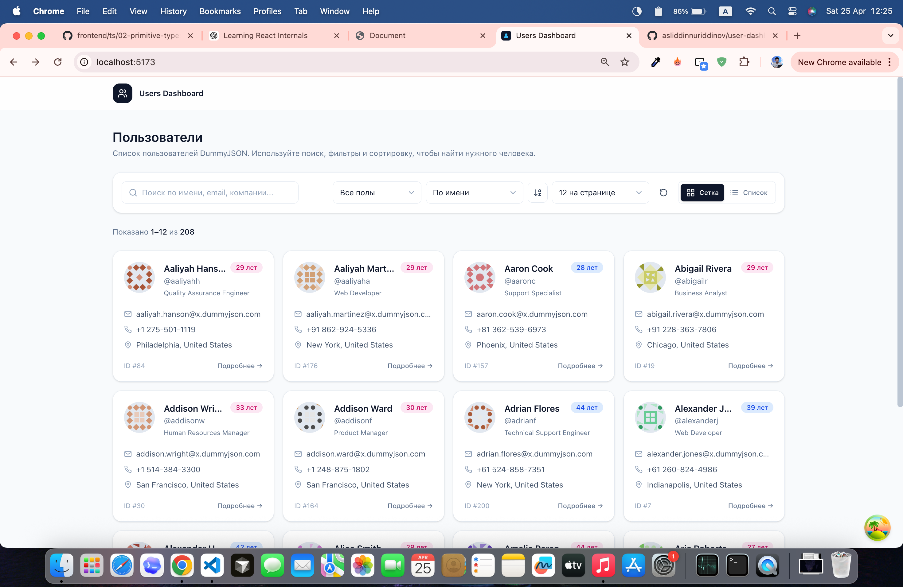
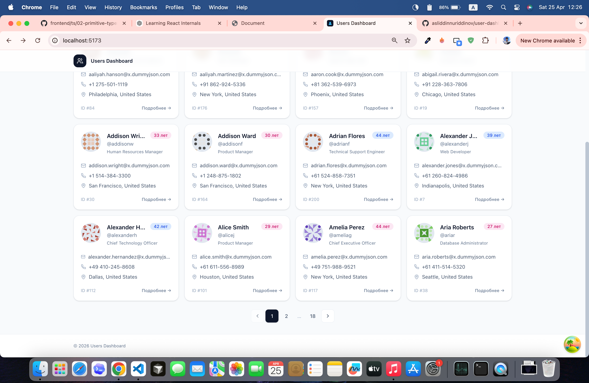
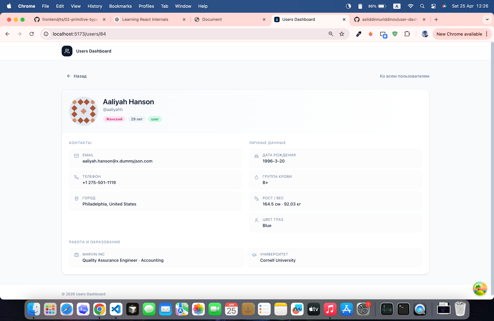

# Users Dashboard

Сделал небольшой дашборд на основе открытого API DummyJSON — скорее как тестовое/пет-проект. Хотел сделать аккуратно по структуре, но без перегруза архитектурой.

API: https://dummyjson.com/users
Доки: https://dummyjson.com/docs/users

## Что есть

Список пользователей с пагинацией (12 / 24 / 48)
Поиск (имя, почта, компания) с дебаунсом
Фильтр по полу
Сортировка (имя, фамилия, возраст, email)
Переключение между grid / list
Страница пользователя с деталями
Скелетоны при загрузке
Empty state и обработка ошибок (с retry)
Адаптив — нормально выглядит и на мобиле, и на десктопе

## Стек

- **React 19 + TypeScript + Vite** — быстро поднять проект без лишнего шума.
- **TanStack Query** — вся работа с сервером тут (кэш, отмена запросов, keepPreviousData и т.д.).
- **Zustand** — для UI-состояния (фильтры, поиск, сортировка).
- **React Router v7** — навигация.
- **Tailwind CSS v4** —стили, никаких отдельных конфигов и постcss не нужно, очень удобно.
- **lucide-react** — иконки, чистый SVG, без лишнего веса.

## Архитектура — Feature-Sliced Design (FSD)

Использовал FSD, потому что удобно разделять:
- сущности (user)
- фичи (поиск, фильтры, пагинация)
- виджеты (готовые блоки)
- страницы

```
src/
├── app/         — composition root: провайдеры (QueryClient), роутер, layout, стили
├── pages/       — страницы (users-list, user-details, not-found)
├── widgets/     — composite-блоки: users-toolbar, users-grid, user-details, app-header
├── features/    — пользовательские фичи: users-list-controls (поиск/фильтр/сортировка/
│                  view-toggle/page-size), pagination
├── entities/    — бизнес-сущности: user (types, api, queries, ui компоненты)
└── shared/      — переиспользуемое: api-клиент, ui-кит, утилиты, конфиг
```

## Запуск

```bash
pnpm install
pnpm dev      # http://localhost:5173
pnpm build    # production-сборка в dist/
pnpm preview  # запустить собранный билд локально
```

## Скриншоты

Список пользователей (сетка):



Список пользователей с пагинацией внизу:



Страница пользователя:



Спасибо что посмотрели.
